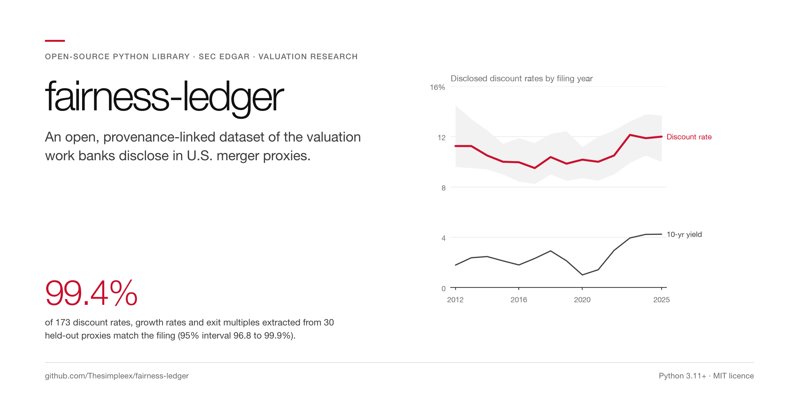
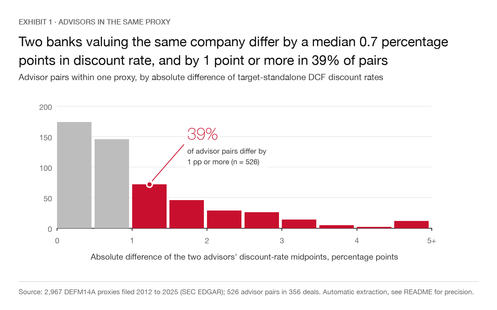
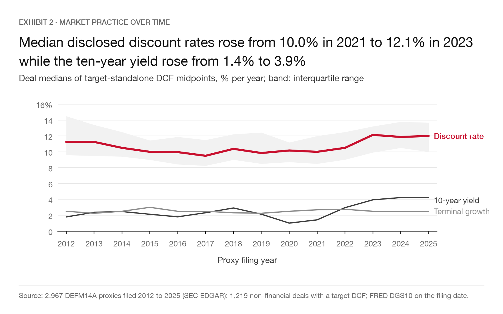
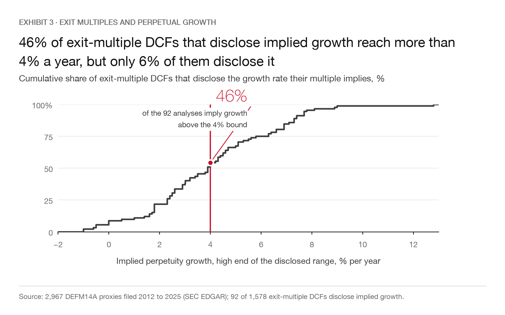
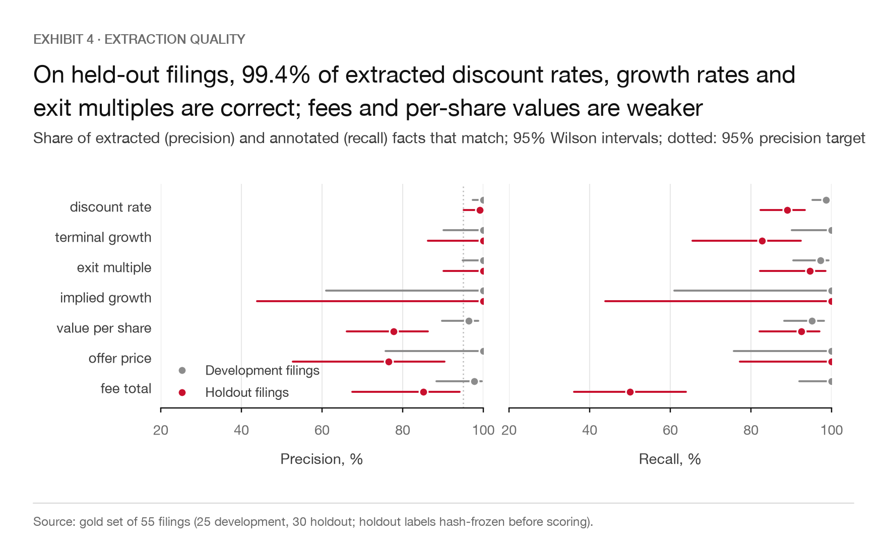
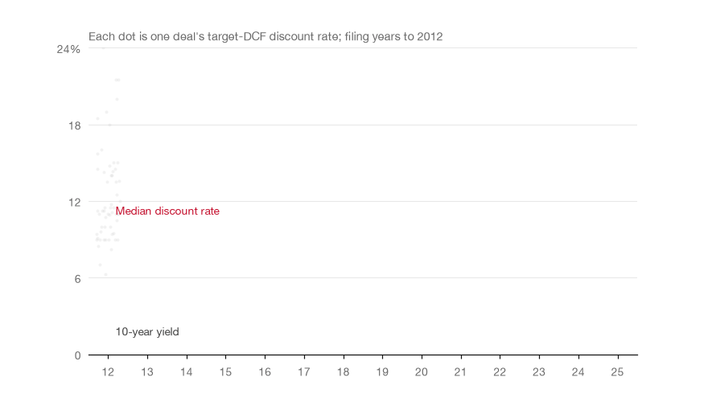

<picture>
  <source media="(prefers-color-scheme: dark)" srcset="docs/banner-dark.png">
  
</picture>

[](https://github.com/Thesimpleex/fairness-ledger/actions/workflows/ci.yml)


An open, provenance-linked dataset and extractor of the valuation work investment banks disclose in U.S. merger proxies: discount rates, terminal growth rates, exit multiples, implied values per share and advisory fees. Every value is linked to the sentence of the filing it comes from.

## Why this matters

When a U.S. public company is sold, the fairness opinions of its financial advisors are summarised in the merger proxy (form DEFM14A). These summaries are the only large public record of how banks actually value companies, but they sit in unstructured filings of 150 pages or more. Studies of them rely on private hand-collected samples. fairness-ledger turns the filings from 2012 to 2025 into a dataset that anyone can check line by line, so that questions such as "what discount rates are market practice" or "how much do two banks disagree on the same company" can be answered with evidence.

## Key results

All numbers come from `docs/results.json` (2,967 DEFM14A filings, 2,925 deals, 2012 to 2025; 29,242 extracted facts, of which 15,130 are core DCF facts).

<picture>
  <source media="(prefers-color-scheme: dark)" srcset="docs/figures/exhibit1-disagreement-dark.png">
  
</picture>

*Exhibit 1. Pairs of advisors valuing the same target in the same proxy (526 pairs in 356 deals).*

- **Banks disagree.** When two advisors value the same company in the same filing, their discount-rate midpoints differ by 0.70 percentage points at the median; 39% of pairs differ by at least 1 point and 17% by at least 2 points. Terminal growth midpoints differ by 0.375 points at the median (180 pairs).

<picture>
  <source media="(prefers-color-scheme: dark)" srcset="docs/figures/exhibit2-market-practice-dark.png">
  
</picture>

*Exhibit 2. Discount-rate midpoints of non-financial targets by year next to the 10-year Treasury yield (FRED DGS10).*

- **Discount rates follow rates, partly.** Across 1,219 deals, a 1 point higher 10-year Treasury yield goes with a 0.60 point higher banker discount rate (0.60 with industry fixed effects). This is descriptive, not causal. Terminal growth does not follow rates (slope -0.11, 687 deals).

<picture>
  <source media="(prefers-color-scheme: dark)" srcset="docs/figures/exhibit3-implied-growth-dark.png">
  
</picture>

*Exhibit 3. Exit-multiple DCFs that disclose the implied perpetuity growth rate (92 of 1,578).*

- **Exit multiples can imply implausible growth.** Where the implied perpetuity growth rate is disclosed, the high end of the range exceeds 4% nominal growth in 46% of cases and the midpoint in 26%. Only 5.8% of exit-multiple DCFs disclose it, so this subset is small and may not be representative.

<picture>
  <source media="(prefers-color-scheme: dark)" srcset="docs/figures/exhibit4-extraction-quality-dark.png">
  
</picture>

*Exhibit 4. Extraction quality on the frozen holdout set.*

- **Extraction quality.** On a holdout set annotated directly from the filing text and frozen by hash before evaluation, precision is 99.1% for discount rates, 100% for terminal growth and 100% for exit multiples; recall is 89.0%, 82.8% and 94.6%. Implied values per share are harder (precision 77.8%).

<picture>
  <source media="(prefers-color-scheme: dark)" srcset="docs/animations/discount-rates-by-year-dark.gif">
  
</picture>

## How it works

1. **Discovery.** EDGAR full-text search finds DEFM14A filings that mention DCF analyses, one year at a time, with completeness checks; filings are grouped into deals.
2. **Document model.** HTML is converted to text with a character-offset map; bank-opinion sections are segmented and each analysis is attributed to its advisor (with an explicit "unattributed" bucket).
3. **Extraction.** A tested grammar reads ranges and point values (percentages, multiples, dollar amounts, worded and parenthetical negatives).
4. **Provenance.** Every value keeps its character span and a short verbatim snippet; a value whose text is not found inside its span is rejected.
5. **Consistency.** Low below high, terminal growth below discount rate, plausibility bounds; atypical values are flagged, not silently dropped.
6. **Evaluation.** Precision and recall per field on a development set and a frozen holdout set (`docs/annotation_guide.md`, `gold/`).

Details: [`docs/methodology.md`](docs/methodology.md).

## What is standard and what is new

Fairness-opinion summaries have been studied before with private hand-collected data (for example Kisgen, Qian and Song 2009; Cain and Denis 2013). New here is an open, reproducible and validated dataset through 2025 in which every number is traceable to its source sentence, together with the extractor and the evaluation set.

## Installation and usage

```bash
pip install git+https://github.com/Thesimpleex/fairness-ledger
```

```bash
export SEC_USER_AGENT="Your Name your.email@example.com"
fairness-ledger fetch --years 2012-2025      # discover and cache DEFM14A filings
fairness-ledger extract                      # extract facts with provenance
fairness-ledger show <ticker-or-accession>   # one deal's analyses side by side, with sources
fairness-ledger report --out report.html     # HTML market-practice report
fairness-ledger evaluate holdout             # precision and recall on the frozen holdout set
```

The released dataset is in `data/release/` (`facts.parquet`, `filings.csv`; `fairness-ledger extract` also writes `facts.csv`):

```python
from fairness_ledger.dataset import load
facts = load()
facts[facts.field == "discount_rate"].groupby("advisor").low.median()
```

## Limitations

- Only deals that file a merger proxy are covered; private targets and tender offers (SC 14D-9) are not yet included.
- Disclosure practice changed over the period, so year-to-year comparisons mix valuation practice and disclosure practice.
- Advisor and subject attribution can be wrong (subject accuracy 83% on the development set); recall is below precision by design.
- All analyses are descriptive.

Illustrative research on public filings, not investment advice. SEC filings are public; the repository ships extracted facts and short snippets only.

## References

- Cain, M. D. and Denis, D. J. (2013). Information production by investment banks: Evidence from fairness opinions. *Journal of Law and Economics* 56(1), 245-280.
- Gormsen, N. J. and Huber, K. (2023). Corporate discount rates. NBER Working Paper 31329.
- Kisgen, D. J., Qian, J. and Song, W. (2009). Are fairness opinions fair? The case of mergers and acquisitions. *Journal of Financial Economics* 91(2), 179-207.

## Licence

MIT. Data derived from SEC EDGAR filings (public domain).
